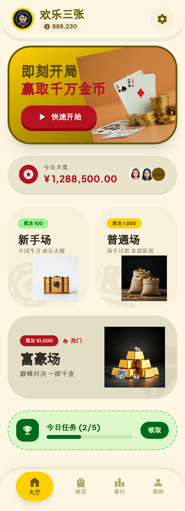
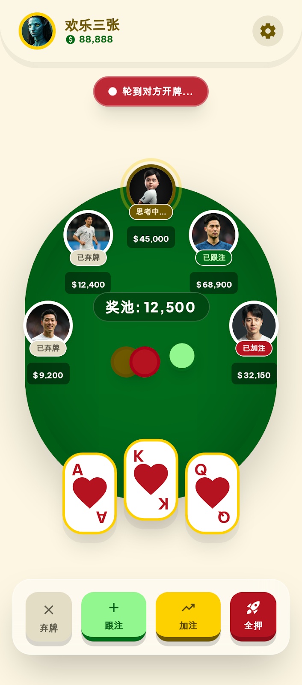
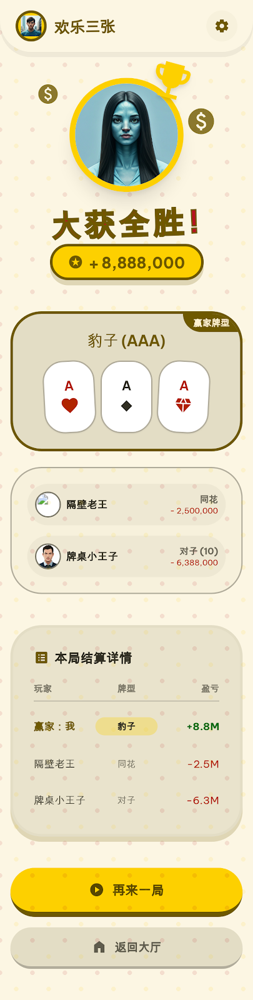
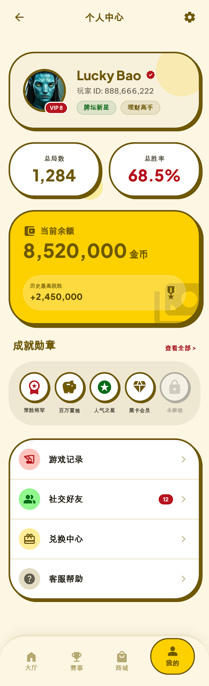
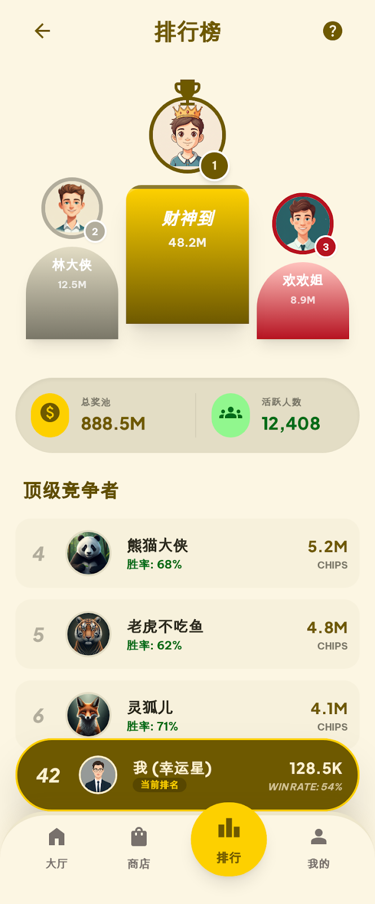
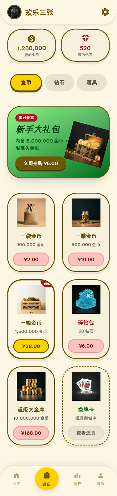

<p align="center">
  <h1 align="center">🃏 欢乐三张 (Poke Three)</h1>
  <p align="center">
    一款精美的在线多人炸金花扑克游戏，支持实时 WebSocket 对战、AI 智能对手、多级场次和丰富的社交系统。
    <br />
    <a href="#-界面预览">界面预览</a>
    ·
    <a href="#-功能特性">功能特性</a>
    ·
    <a href="#-快速开始">快速开始</a>
  </p>
</p>

---

## ✨ 功能特性

- 🎮 **实时对战** — 基于 WebSocket 的低延迟多人实时对战
- 🤖 **AI 对手** — 智能 AI 玩家，支持多种难度级别
- 🏠 **多级场次** — 新手场 / 普通场 / 富豪场，满足不同段位玩家
- 🏆 **排行榜** — 全服排行榜，展示顶级竞争者
- 👤 **个人中心** — 战绩统计、成就勋章、社交好友
- 🛒 **商店系统** — 金币、钻石、道具购买
- 📊 **结算系统** — 完整的对局结算与盈亏统计
- 🔐 **账号系统** — 注册登录、Token 认证

## 🛠 技术栈

| 层级 | 技术 |
|------|------|
| **后端框架** | Java 21 + Spring Boot 3 |
| **ORM** | MyBatis-Plus |
| **实时通信** | WebSocket (STOMP) |
| **数据库** | SQLite |
| **前端构建** | Vite |
| **前端框架** | Vanilla JavaScript |
| **CSS 框架** | TailwindCSS |

## 📁 项目结构

```
poke_three/
├── backend/                  # 后端服务
│   ├── Dockerfile            # 后端 Docker 镜像
│   ├── src/main/java/com/pokethree/
│   │   ├── config/           # 配置类 (CORS, WebSocket)
│   │   ├── controller/       # REST 控制器
│   │   ├── entity/           # 数据实体
│   │   ├── game/             # 游戏核心引擎
│   │   │   ├── Card.java         # 扑克牌
│   │   │   ├── CardDeck.java     # 牌组
│   │   │   ├── GameRoom.java     # 游戏房间状态机
│   │   │   ├── HandEvaluator.java# 牌型评估器
│   │   │   └── AIPlayer.java     # AI 玩家
│   │   ├── mapper/           # 数据访问层
│   │   ├── service/          # 业务逻辑层
│   │   └── ws/               # WebSocket 端点
│   └── src/main/resources/   # 配置文件 & SQL
├── frontend/                 # 前端项目
│   ├── Dockerfile            # 前端 Docker 镜像
│   ├── nginx.conf            # Nginx 反向代理配置
│   ├── src/
│   │   ├── components/       # UI 组件
│   │   ├── pages/            # 页面模块
│   │   └── styles/           # 样式文件
│   └── public/               # 静态资源
├── docker-compose.yml        # Docker 一键编排
├── docs/screenshots/         # UI 截图
├── LICENSE                   # MIT 开源协议
└── README.md
```

## 📸 界面预览

<table>
  <tr>
    <td align="center" width="33%">
      <br />
      <b>🏠 游戏大厅</b><br />
      <sub>多级场次选择，今日大奖与每日任务</sub>
    </td>
    <td align="center" width="33%">
      <br />
      <b>🎮 牌桌对战</b><br />
      <sub>6人牌桌，实时下注、跟注、加注、全押</sub>
    </td>
    <td align="center" width="33%">
      <br />
      <b>🏅 对局结算</b><br />
      <sub>赢家展示、牌型对比、盈亏详情</sub>
    </td>
  </tr>
  <tr>
    <td align="center" width="33%">
      <br />
      <b>👤 个人中心</b><br />
      <sub>战绩统计、成就勋章、游戏记录</sub>
    </td>
    <td align="center" width="33%">
      <br />
      <b>🏆 排行榜</b><br />
      <sub>全服排名，顶级竞争者展示</sub>
    </td>
    <td align="center" width="33%">
      <br />
      <b>🛒 商店</b><br />
      <sub>金币充值、钻石购买、道具商城</sub>
    </td>
  </tr>
</table>

## 🚀 快速开始

### 🐳 Docker 部署（推荐）

确保已安装 [Docker](https://docs.docker.com/get-docker/) 和 Docker Compose，然后执行：

```bash
# 构建并启动
docker compose up -d

# 查看运行状态
docker compose ps

# 查看日志
docker compose logs -f

# 停止服务
docker compose down
```

启动后访问 `http://localhost` 即可畅玩 🎮

> **数据持久化**：SQLite 数据库通过 Docker Volume `poke-data` 持久化，`docker compose down` 不会丢失数据。如需彻底清除，执行 `docker compose down -v`。

---

### 本地开发

#### 环境要求

- Java 21+
- Maven 3.6+
- Node.js 18+

#### 后端启动

```bash
cd backend
mvn spring-boot:run
```

后端默认运行在 `http://localhost:3000`

#### 前端启动

```bash
cd frontend
npm install
npm run dev
```

前端默认运行在 `http://localhost:5173`

## 🎲 游戏规则 — 炸金花

炸金花（Three Card Poker）是一种流行的扑克牌游戏，每位玩家发 3 张牌，通过比较牌型大小决定胜负。

### 牌型大小（从大到小）

| 排名 | 牌型 | 说明 |
|:----:|------|------|
| 1 | 🔥 **豹子** | 三张同点（如 AAA） |
| 2 | 🌊 **同花顺** | 同花色且连续（如 ♠️5♠️6♠️7） |
| 3 | 📐 **同花** | 同花色不连续 |
| 4 | 📈 **顺子** | 不同花色且连续 |
| 5 | 👯 **对子** | 两张同点 + 一张单牌 |
| 6 | 🃏 **散牌** | 不构成以上任何牌型 |

## 📄 开源协议

本项目基于 [MIT License](LICENSE) 开源 — 你可以自由使用、修改、分发。
